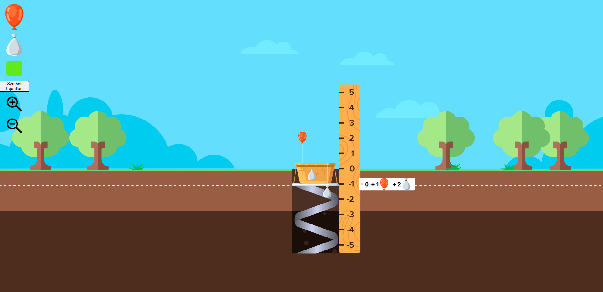

# **SVG and Math**
### **Description:**
One of several projects made for KnowledgeHook using Angular, Typescript, SVGs, the GSAP animation library, and Material.io. This is a math manipulative to
help students visualize pluses minuses

### **Link To Site:**
[site](https://regal-treacle-65912d.netlify.app/)

## **Autor:**
Michele Akeson

